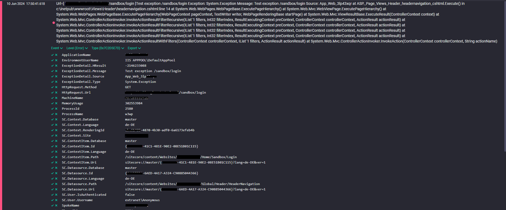
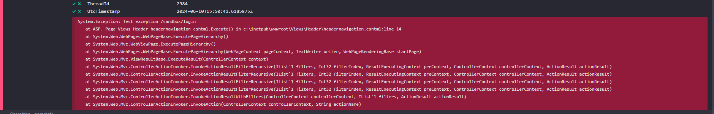

# Sitecore Serilog
[](https://github.com/izharikov/SitecoreSerilog/actions/workflows/dotnet.yml)

[](https://www.nuget.org/packages/SitecoreSerilog)
[](https://www.nuget.org/packages/SitecoreSerilog)

Provides [Serilog](https://github.com/serilog/serilog) appender for Sitecore.

## Features
- Serilog integration in Sitecore
- Use any [Sink](https://github.com/serilog/serilog/wiki/Provided-Sinks) from Serilog with Sitecore
- Custom enricher for Sitecore context (like database, context item, page item, rendering, datasource, etc) in log event (with option to extend it)
- Custom HTTP context enricher (currently HTTP method and URL are logged)
- Add your custom enrichers

### SEQ Example
You can see how your log event with exception details could look like (in [SEQ](https://datalust.co/seq)):




## Usage
See [examples](./SitecoreSerilog.Example) project for more details.

### Appender
Create a custom appender:
```csharp
namespace SitecoreSerilog.Example
{
    public class BaseSeqSitecoreAppender : BaseSitecoreSerilogAppender
    {
        public string ApiKey { get; set; }
        public string SeqHost { get; set; }

        // configure Enrichers here (use listed below or define your own enrichers):
        protected override LoggerConfiguration Enrich(LoggerConfiguration configuration)
        {
            return configuration
                    // application name enricher (so you know, which site is used)
                    .Enrich.WithApplicationName(() => Sitecore.Context.Site?.Name ?? "FallbackValue")
                    // spoke name enricher (so you know, which environment is used)
                    .Enrich.WithSpokeName(Settings.GetSetting("SpokeName"))
                    .Enrich.FromLogContext()
                    .Enrich.WithUtcTimestamp()
                    .Enrich.WithMachineName()
                    .Enrich.WithEnvironmentUserName()
                    .Enrich.WithProcessId()
                    .Enrich.WithProcessName()
                    .Enrich.WithThreadId()
                    .Enrich.WithMemoryUsage()
                    // custom SitecoreContextEnricher - so you can see the Sitecore Context Details in log event
                    .Enrich.WithSitecoreContext((options) => { options.MinLevel = LogEventLevel.Error; })
                    // custom HttpContextEnricher - so you can see HttpContext details in log event
                    .Enrich.WithHttpContext(LogEventLevel.Error)
                ;
        }

        // configure where Serilog should write
        protected override LoggerConfiguration WriteTo(LoggerConfiguration configuration)
        {
            return configuration
                // in this example I write to SEQ, but you can use any Sink you need
                .WriteTo.Seq(SeqHost, apiKey: ApiKey);
        }

        // validate your configuration (if returned false - Serilog won't write anything)
        protected override bool ValidateConfiguration()
        {
            return !string.IsNullOrEmpty(SeqHost);
        }
    }
}
```

### Configuration:
Use your appender:
```xml
<configuration xmlns:patch="http://www.sitecore.net/xmlconfig/"
               xmlns:set="http://www.sitecore.net/xmlconfig/set/">
    <sitecore>
        <log4net>
            <!-- use custom appender class here: -->
            <appender name="SerilogAppender"
                      type="SitecoreSerilog.Example.BaseSeqSitecoreAppender, SitecoreSerilog.Example"
                      patch:after="appender[@name='LogFileAppender']">
                <minimumlevel value="INFO" />
                <apikey value="$(env:SEQ_API_KEY)" />
                <seqhost value="$(env:SEQ_URL)" />
                <layout type="log4net.Layout.PatternLayout" />
                <encoding value="utf-8" />
            </appender>

            <!-- add it to root logger -->
            <root>
                <appender-ref ref="SerilogAppender" patch:after="*[@ref='LogFileAppender']" />
            </root>
            
            <!-- or add it to any other logger, e.g. Crawling: -->
            <logger name="Sitecore.Diagnostics.Crawling">
                <appender-ref ref="SerilogAppender" patch:after="*[@ref='CrawlingLogFileAppender']" />
            </logger>
        </log4net>
    </sitecore>
</configuration>
```

## Enrichers
### [`SitecoreContextEnricher`](./SitecoreSerilog/Enrichers/SitecoreContextEnricher.cs)
#### Default usage
```csharp
.Enrich.WithSitecoreContext(LogEventLevel.Error)
```

#### Advanced usage
E.g. add additional items to Logger:

```csharp
.Enrich.WithSitecoreContext(options =>
    {
        // configure min log level: 
        options.MinLevel = LogEventLevel.Error;
        // extend default enrich object:
        options
            // add current Sitecore MVC page context
            .WithItem("PageItem", () => PageContext.CurrentOrNull?.Item)
            // add current rendering datasource
            .WithItem("Datasource", () => RenderingContext.CurrentOrNull?.Rendering?.Item)
            .WithContextOption(Constants.OptionNames.Context,
                context =>
                {
                    // add current RenderingId
                    context.WithProperty("RenderingId",
                        () => RenderingContext.CurrentOrNull?.Rendering?.Id.ToString());
                })
            ;
    })
```

### [`HttpContextEnricher`](./SitecoreSerilog/Enrichers/HttpContextEnricher.cs)
#### Default usage
```csharp
.Enrich.WithHttpContext(LogEventLevel.Error)
```

## Contribute / Bug / Help
You can contact me via email or in Sitecore Slack: `zharikovigor97@gmail.com`. Or please open an [issue](https://github.com/izharikov/SitecoreSerilog/issues/new).
